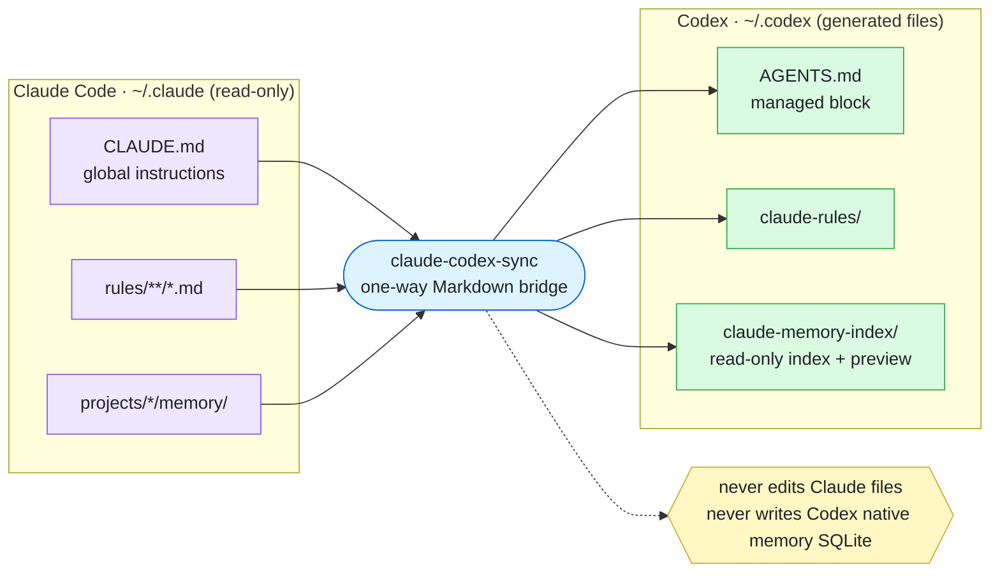
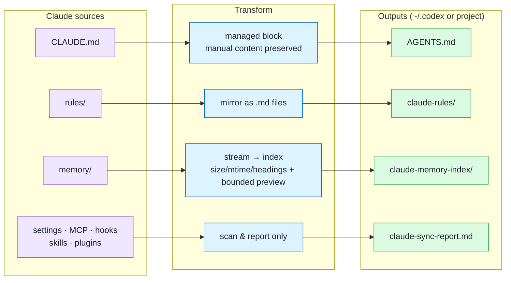
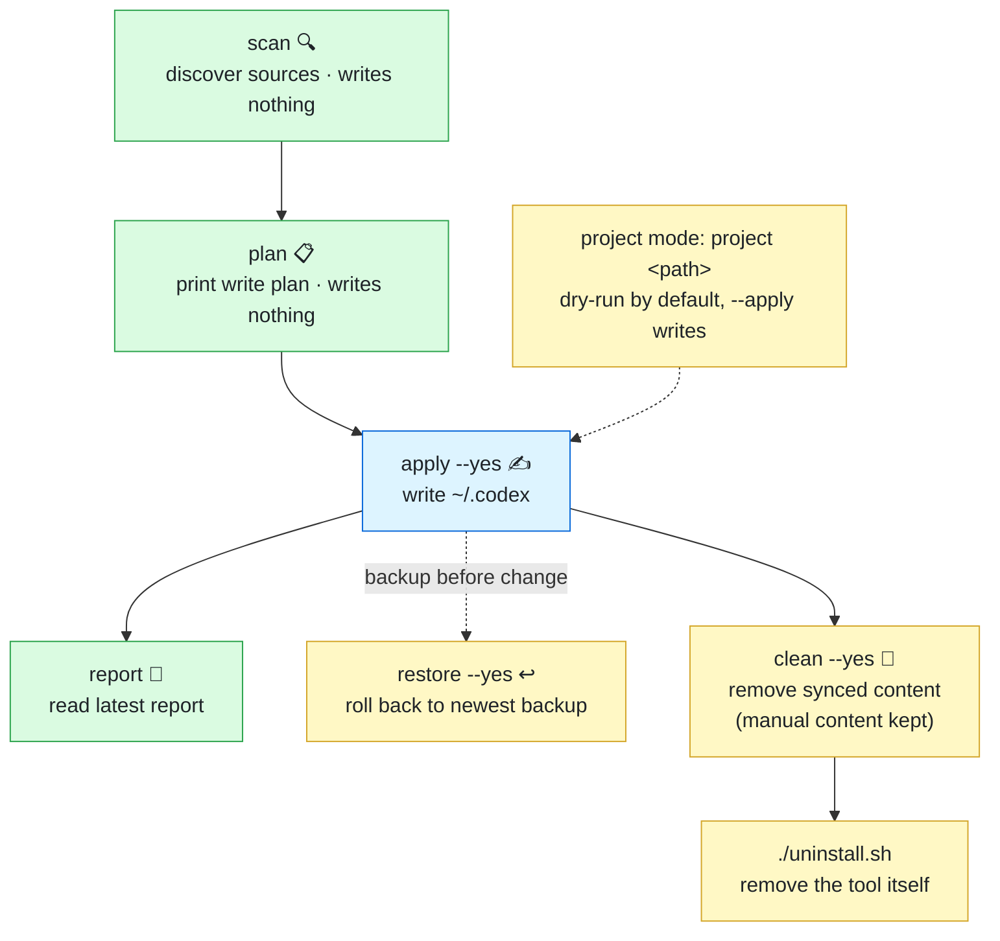

# claude-codex-sync

English | [中文](README.zh-CN.md)

Move useful Claude Code context into places Codex can read, without touching Claude state or Codex's native memory database.

> Disclaimer. This is a local migration helper for personal machines. It writes Markdown bridge files, reports, manifests, and backups only after explicit apply commands. Read the plan output before applying, especially if your Claude memory contains private project context.

New here? Read [How it works](docs/HOW-IT-WORKS.md) for the design, safety model, and file-by-file behavior.

## Overview

**What it does** — one-way bridge from Claude context to Codex-readable files. It never touches Claude, and never writes Codex's native memory database.



**How it works** — each source has its own transform; memory becomes a streamed index with a bounded preview, and settings/skills/plugins are report-only.



**Usage flow** — the main path is look-before-write: `scan` / `plan` write nothing, `apply` writes. `restore` and `clean` are always available.



## What it does

| Command | What it does |
| --- | --- |
| `claude-codex-sync scan` | Finds Claude global instructions, rules, memory folders, and report-only config files. Writes nothing. |
| `claude-codex-sync plan` | Prints the global write plan for Codex Markdown bridge files. Writes nothing. |
| `claude-codex-sync apply --yes` | Applies the global sync into `~/.codex`. Backs up changed files and skips unchanged files. |
| `claude-codex-sync project <path>` | Prints the project-level write plan. Dry-run by default. |
| `claude-codex-sync project <path> --apply` | Writes local project context files under the project. Adds gitignore entries when the target is a Git repo. |
| `claude-codex-sync report` | Prints the latest global report. |
| `claude-codex-sync report --project <path>` | Prints the latest project report. |
| `claude-codex-sync restore [--project <path>]` | Lists which files would roll back to their newest backup. Writes nothing. |
| `claude-codex-sync restore [--project <path>] --yes` | Rolls each synced file back to its newest backup. Backups are kept. |
| `claude-codex-sync clean [--project <path>]` | Lists everything the sync created that would be removed. Writes nothing. |
| `claude-codex-sync clean [--project <path>] --yes` | Removes synced content: managed blocks (manual content kept), generated files, tool-added gitignore entries. Add `--purge-backups` to delete backups too. |

## What it syncs

- `~/.claude/CLAUDE.md` -> managed block in `~/.codex/AGENTS.md`
- `~/.claude/rules/**/*.md` -> `~/.codex/claude-rules/`
- `~/.claude/projects/<project>/memory/` -> `~/.codex/claude-memory-index/projects/<project>.md`
- Project Claude files -> local `AGENTS.override.md`
- Matched project memory -> local `.codex/claude-memory/index.md`

Settings, MCP, hooks, permissions, skills, and plugins are scanned and reported only. They are not migrated automatically. Codex has its own native skill and plugin installation/import flows, so this tool does not copy Claude skill/plugin state into Codex.

## Safety

- Does not write Claude files.
- Does not write Codex native memory SQLite.
- Does not migrate auth, sessions, history, cache, usage data, skills, plugins, or plugin state.
- Skills and plugins should be installed through Codex's native skill/plugin mechanisms instead of copied from Claude directories.
- Global apply requires `--yes`.
- Project mode is dry-run unless `--apply` is passed.
- Files that may hold manual edits (`AGENTS.md`, `AGENTS.override.md`, mirrored rules, `.gitignore`) are backed up before changed. Regenerated outputs (report, manifest, memory indexes) are overwritten without backups so repeated applies do not accumulate backup files.
- Unchanged files are skipped.
- Large memory files are parsed as streams. The index records size, mtime, total line count, Markdown headings, a bounded preview (first 40 lines / 64 KiB — for smaller files this is the full text), and truncation warnings.

Privacy note: the generated files under `~/.codex` (AGENTS.md, memory indexes) contain your global `CLAUDE.md` and memory previews. If you sync `~/.codex` to a dotfiles repo or any shared location, review these files first — publishing them publishes that context.

## Requirements

- Node.js 20 or newer.
- npm.
- Claude Code data under `~/.claude`.
- Codex using `~/.codex`, or set `CODEX_HOME` if your Codex home is elsewhere.

## Install

One-click install (clone, then run the script):

```bash
git clone https://github.com/RuntianLee/claude-codex-sync.git
cd claude-codex-sync
./install.sh
```

The script installs dependencies, builds the CLI, and puts a `claude-codex-sync` launcher into `~/.local/bin` (override with `CLAUDE_CODEX_SYNC_BIN_DIR`). It never edits your shell profile; it prints a PATH hint if needed.

Prefer manual steps? The script only does:

```bash
npm install
npm run build
# then use: node dist/index.js  (or create your own alias)
```

## Recommended first run

Run the commands in this order. The first two commands are read-only.

```bash
# 1. Discover Claude sources and report-only config.
# Writes nothing.
node dist/index.js scan

# 2. Show the exact global files that would be written under ~/.codex.
# Writes nothing.
node dist/index.js plan

# 3. Apply the global sync after reviewing the plan.
# Writes ~/.codex/AGENTS.md, ~/.codex/claude-rules/,
# ~/.codex/claude-memory-index/, a report, and a manifest.
node dist/index.js apply --yes

# 4. Read the generated global report.
node dist/index.js report
```

If your Codex home is not `~/.codex`, set `CODEX_HOME` for every command:

```bash
CODEX_HOME=/path/to/codex-home node dist/index.js plan
CODEX_HOME=/path/to/codex-home node dist/index.js apply --yes
```

## Project mode

Project mode creates local Codex context for one repository. Start with dry-run:

```bash
# Replace /path/to/repo with your project folder.
# This prints operations only. It writes nothing.
node dist/index.js project /path/to/repo

# Apply only after reviewing the dry-run output.
# This writes project-local files and updates .gitignore when the target is a Git repo.
node dist/index.js project /path/to/repo --apply

# Read the generated project report.
node dist/index.js report --project /path/to/repo
```

Project outputs are intended to stay local and gitignored:

- `AGENTS.override.md`
- `.codex/claude-memory/`
- `.codex/claude-sync-manifest.json`
- `.codex/claude-sync-report.md`

## What to inspect after apply

Global sync:

```bash
less ~/.codex/AGENTS.md
less ~/.codex/claude-sync-report.md
ls ~/.codex/claude-memory-index/projects
```

Project sync:

```bash
less /path/to/repo/AGENTS.override.md
less /path/to/repo/.codex/claude-sync-report.md
less /path/to/repo/.codex/claude-memory/index.md
```

## Undo

The tool creates backup files before changing existing files that may hold manual edits. Backup names look like:

```text
AGENTS.md.claude-codex-sync-backup-20260702-123456-789
```

To roll back, use the restore command (dry-run first, like everything else):

```bash
node dist/index.js restore            # list what would be restored
node dist/index.js restore --yes      # roll back to the newest backups
node dist/index.js restore --project /path/to/repo --yes
```

Restore keeps the backup files, so it is safe to repeat; re-running `apply` redoes the sync. Files created by the first sync have no backup — remove them or the managed block by hand.

To undo a generated block manually, restore the backup or remove the managed block between:

```md
<!-- BEGIN CLAUDE_CODEX_SYNC:GLOBAL -->
...
<!-- END CLAUDE_CODEX_SYNC:GLOBAL -->
```

## Uninstall

One-click uninstall (default behavior — the tool goes away, your synced context stays):

```bash
./uninstall.sh
```

This removes the launcher and this repository folder. Everything the tool synced — managed blocks, rules mirror, memory indexes, and all backups — is kept, so Codex keeps working with the last synced context. The script refuses to delete a repo with uncommitted changes unless you pass `--force`.

Want a full cleanup instead? Run these BEFORE uninstalling:

```bash
# Optional: roll synced files back to their pre-sync state first.
claude-codex-sync restore --yes

# Remove everything the sync created. Backups are kept unless you add --purge-backups.
claude-codex-sync clean --yes
claude-codex-sync clean --project /path/to/repo --yes

./uninstall.sh
```

`clean` removes only the managed blocks from `AGENTS.md` / `AGENTS.override.md` (your manual content stays), deletes the generated rules mirror, memory indexes, reports, and manifests, and strips the tool's `.gitignore` entries. If you skip `clean`, everything keeps working — just remember the bridged context is frozen at the last sync.

## How it works

See [docs/HOW-IT-WORKS.md](docs/HOW-IT-WORKS.md).
