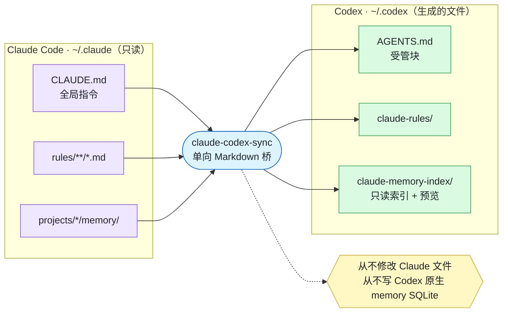
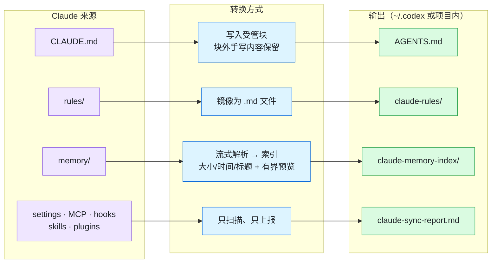
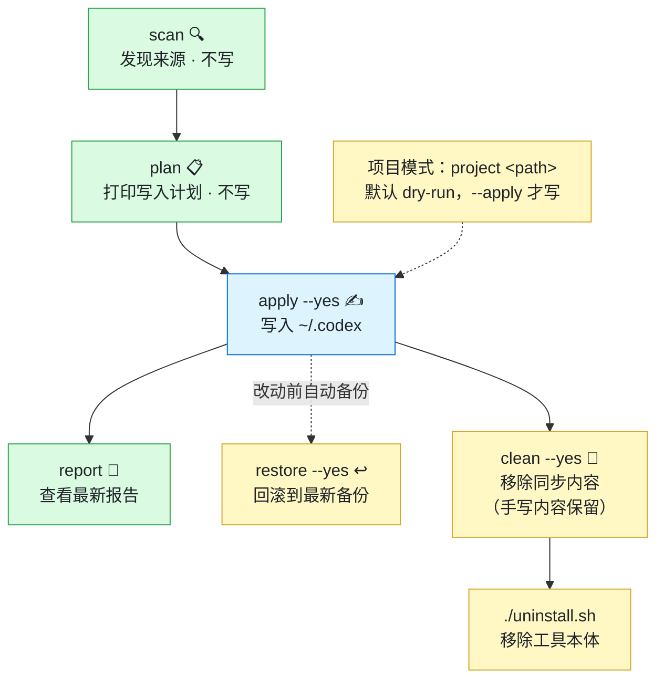

# claude-codex-sync

[English](README.md) | 中文

把 Claude Code 中有价值的本机上下文转换到 Codex 可读取的位置，同时不修改 Claude 状态，也不直接写入 Codex 原生 memory 数据库。

> 免责声明：这是面向个人本机的迁移辅助工具。它只在显式 apply 命令后写入 Markdown bridge、报告、manifest 和备份。执行前请先阅读 plan 输出，尤其当 Claude memory 中包含私有项目上下文时。

第一次使用建议先读：[工作原理](docs/HOW-IT-WORKS.zh-CN.md)。

## 概览

**作用** —— 把 Claude 上下文单向桥接成 Codex 可读的文件。不碰 Claude，也不写 Codex 原生 memory 数据库。



**原理** —— 每种来源各有转换方式；memory 变成流式索引 + 有界预览，而 settings/skills/plugins 只上报不迁移。



**使用流程** —— 主路径先看后写：`scan` / `plan` 不写，`apply` 才落盘。`restore` 与 `clean` 随时可用。



## 能做什么

| 命令 | 作用 |
| --- | --- |
| `claude-codex-sync scan` | 发现 Claude 全局指令、rules、memory 目录和只报告配置文件。不写入。 |
| `claude-codex-sync plan` | 打印全局 Codex Markdown bridge 写入计划。不写入。 |
| `claude-codex-sync apply --yes` | 执行全局同步到 `~/.codex`。修改前备份，内容不变时跳过。 |
| `claude-codex-sync project <path>` | 打印项目级写入计划。默认 dry-run。 |
| `claude-codex-sync project <path> --apply` | 在目标项目下写入本地上下文文件；如果目标是 Git 仓库，会补 `.gitignore`。 |
| `claude-codex-sync report` | 打印最近一次全局报告。 |
| `claude-codex-sync report --project <path>` | 打印最近一次项目报告。 |
| `claude-codex-sync restore [--project <path>]` | 列出哪些文件可以回滚到最新备份。不写任何文件。 |
| `claude-codex-sync restore [--project <path>] --yes` | 把每个被同步的文件回滚到最新备份。备份文件保留。 |
| `claude-codex-sync clean [--project <path>]` | 列出同步产生的所有可移除内容。不写任何文件。 |
| `claude-codex-sync clean [--project <path>] --yes` | 移除同步内容：托管区块（手写内容保留）、生成文件、工具加的 gitignore 条目。加 `--purge-backups` 连备份一起删。 |

## 同步范围

- `~/.claude/CLAUDE.md` -> `~/.codex/AGENTS.md` 托管区块
- `~/.claude/rules/**/*.md` -> `~/.codex/claude-rules/`
- `~/.claude/projects/<project>/memory/` -> `~/.codex/claude-memory-index/projects/<project>.md`
- 项目 Claude 文件 -> 本地 `AGENTS.override.md`
- 匹配到的项目 memory -> 本地 `.codex/claude-memory/index.md`

settings、MCP、hooks、permissions、skills、plugins 只扫描和报告，不自动迁移。Codex 对 skill 和 plugin 有自己的原生安装/导入机制，因此本工具不会把 Claude 的 skill/plugin 状态直接复制到 Codex。

## 安全边界

- 不写 Claude 文件。
- 不写 Codex 原生 memory SQLite。
- 不迁移 auth、sessions、history、cache、usage data、skills、plugins、plugin state。
- skills 和 plugins 应通过 Codex 原生 skill/plugin 机制安装或导入，而不是从 Claude 目录直接复制。
- 全局 apply 必须传 `--yes`。
- 项目模式默认 dry-run，除非显式传 `--apply`。
- 可能含人工内容的文件（`AGENTS.md`、`AGENTS.override.md`、rules 镜像、`.gitignore`）在修改前会备份；纯生成物（report、manifest、memory index）直接覆盖不备份，反复 apply 不会积累备份文件。
- 内容完全相同时跳过写入。
- 大型 memory 文件会流式解析。index 会记录大小、修改时间、总行数、Markdown 标题索引、有上限的预览（前 40 行 / 64 KiB——小于该上限的文件预览即全文）和截断 warning。

隐私提示：`~/.codex` 下生成的文件（AGENTS.md、memory index）包含你的全局 `CLAUDE.md` 和 memory 预览。如果你把 `~/.codex` 同步到 dotfiles 仓库或其他共享位置，请先检查这些文件——发布它们等于发布这些上下文。

## 前置条件

- Node.js 20 或更高版本。
- npm。
- Claude Code 数据位于 `~/.claude`。
- Codex 使用 `~/.codex`；如果你的 Codex home 不在这里，请设置 `CODEX_HOME`。

## 安装

一键安装（clone 后跑脚本）：

```bash
git clone https://github.com/RuntianLee/claude-codex-sync.git
cd claude-codex-sync
./install.sh
```

脚本会安装依赖、构建 CLI，并在 `~/.local/bin` 放一个 `claude-codex-sync` 启动器（可用 `CLAUDE_CODEX_SYNC_BIN_DIR` 覆盖位置）。它不会改你的 shell 配置文件；不在 PATH 上时会打印提示。

想手动装？脚本做的只是：

```bash
npm install
npm run build
# 然后使用：node dist/index.js（或自建 alias）
```

## 推荐首次运行流程

建议按下面顺序执行。前两个命令都是只读的。

```bash
# 1. 扫描 Claude 来源和只报告配置。
# 不写入任何文件。
node dist/index.js scan

# 2. 显示将要写入 ~/.codex 的全局文件计划。
# 不写入任何文件。
node dist/index.js plan

# 3. 人工检查 plan 后再执行全局同步。
# 会写入 ~/.codex/AGENTS.md、~/.codex/claude-rules/、
# ~/.codex/claude-memory-index/、报告和 manifest。
node dist/index.js apply --yes

# 4. 查看生成的全局报告。
node dist/index.js report
```

如果你的 Codex home 不是 `~/.codex`，每条命令都带上 `CODEX_HOME`：

```bash
CODEX_HOME=/path/to/codex-home node dist/index.js plan
CODEX_HOME=/path/to/codex-home node dist/index.js apply --yes
```

## 项目模式

项目模式会为某个仓库生成本地 Codex 上下文。先 dry-run：

```bash
# 把 /path/to/repo 替换成你的项目目录。
# 只打印操作计划，不写入文件。
node dist/index.js project /path/to/repo

# 检查 dry-run 输出后再应用。
# 会写入项目本地文件；如果目标是 Git 仓库，还会更新 .gitignore。
node dist/index.js project /path/to/repo --apply

# 查看生成的项目报告。
node dist/index.js report --project /path/to/repo
```

项目输出默认应留在本地并被 gitignore：

- `AGENTS.override.md`
- `.codex/claude-memory/`
- `.codex/claude-sync-manifest.json`
- `.codex/claude-sync-report.md`

## apply 后应该检查什么

全局同步：

```bash
less ~/.codex/AGENTS.md
less ~/.codex/claude-sync-report.md
ls ~/.codex/claude-memory-index/projects
```

项目同步：

```bash
less /path/to/repo/AGENTS.override.md
less /path/to/repo/.codex/claude-sync-report.md
less /path/to/repo/.codex/claude-memory/index.md
```

## 如何撤销

工具在修改可能含人工内容的已有文件前会创建备份。备份文件名类似：

```text
AGENTS.md.claude-codex-sync-backup-20260702-123456-789
```

回滚用 `restore` 命令（和其他命令一样，先干跑再执行）：

```bash
node dist/index.js restore            # 列出会恢复哪些文件
node dist/index.js restore --yes      # 回滚到最新备份
node dist/index.js restore --project /path/to/repo --yes
```

`restore` 会保留备份文件，可以放心重复执行；想"重做"同步就再跑一次 `apply`。首次同步新建的文件没有备份——手动删除文件或托管区块即可。

如果要手动撤销，也可以直接恢复备份，或删除下面标记之间的托管区块：

```md
<!-- BEGIN CLAUDE_CODEX_SYNC:GLOBAL -->
...
<!-- END CLAUDE_CODEX_SYNC:GLOBAL -->
```

## 如何卸载

一键卸载（默认行为——工具消失，同步的上下文保留）：

```bash
./uninstall.sh
```

脚本会删除启动器和本仓库文件夹。工具同步的所有内容——托管区块、rules 镜像、memory index、全部备份——原样保留，Codex 继续用最后一次同步的上下文工作。仓库有未提交改动时脚本会拒绝删除，加 `--force` 才强删。

想彻底清理？在卸载**之前**执行：

```bash
# 可选：先把被同步的文件回滚到同步前的状态。
claude-codex-sync restore --yes

# 移除同步产生的全部内容。备份默认保留，加 --purge-backups 才删。
claude-codex-sync clean --yes
claude-codex-sync clean --project /path/to/repo --yes

./uninstall.sh
```

`clean` 只从 `AGENTS.md` / `AGENTS.override.md` 里摘除托管区块（你手写的内容保留），删除生成的 rules 镜像、memory index、报告和 manifest，并清掉工具加的 `.gitignore` 条目。不跑 `clean` 直接删仓库也可以——只是记住桥接上下文会冻结在最后一次同步。

## 工作原理

见 [docs/HOW-IT-WORKS.zh-CN.md](docs/HOW-IT-WORKS.zh-CN.md)。
