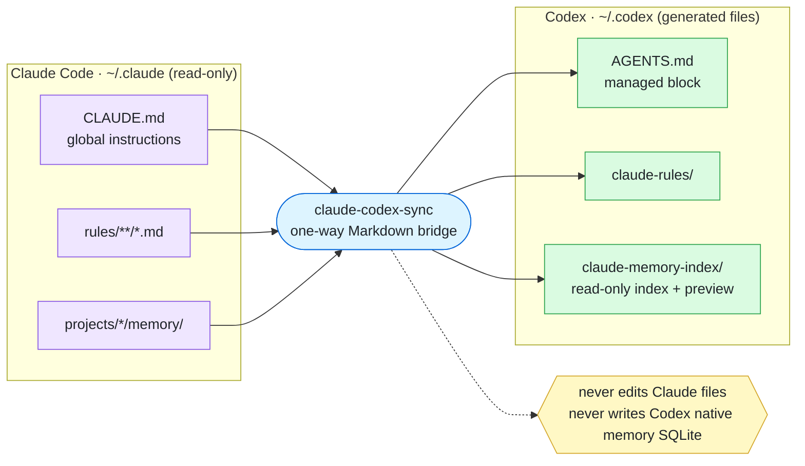
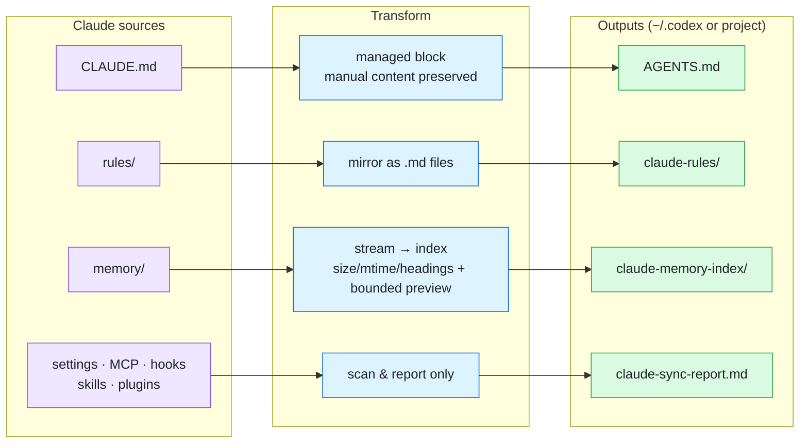
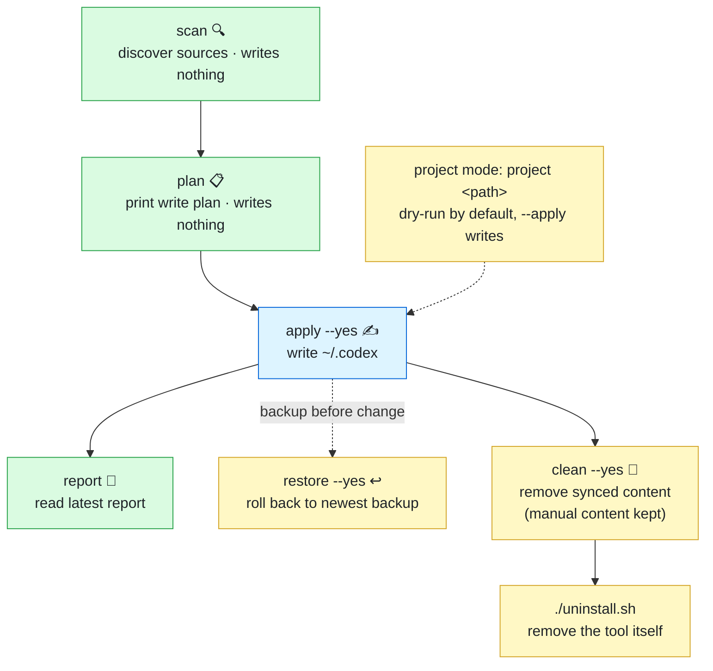
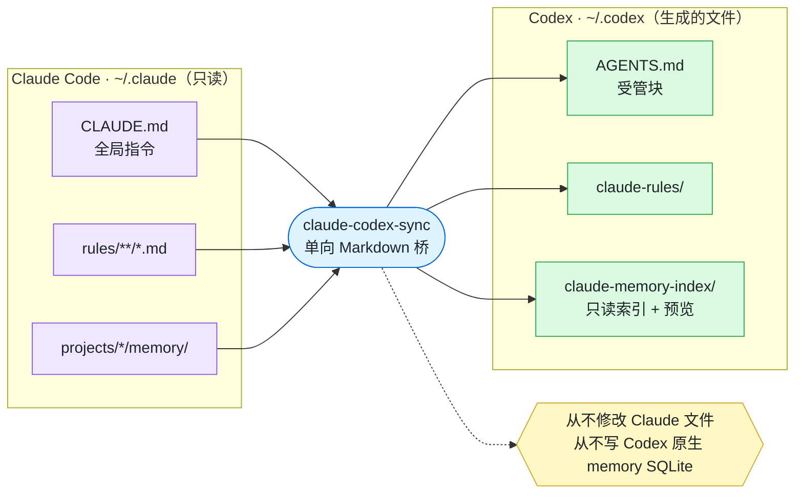
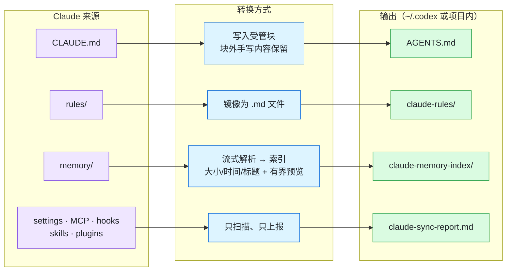
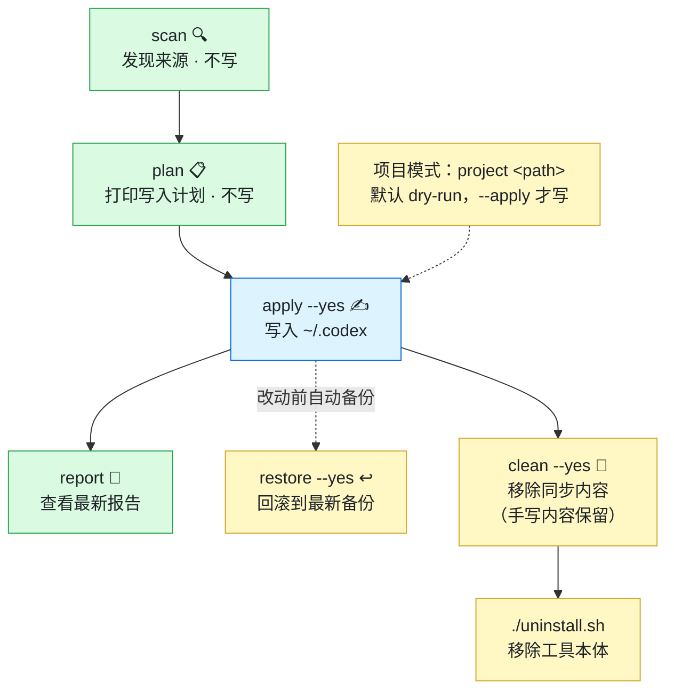
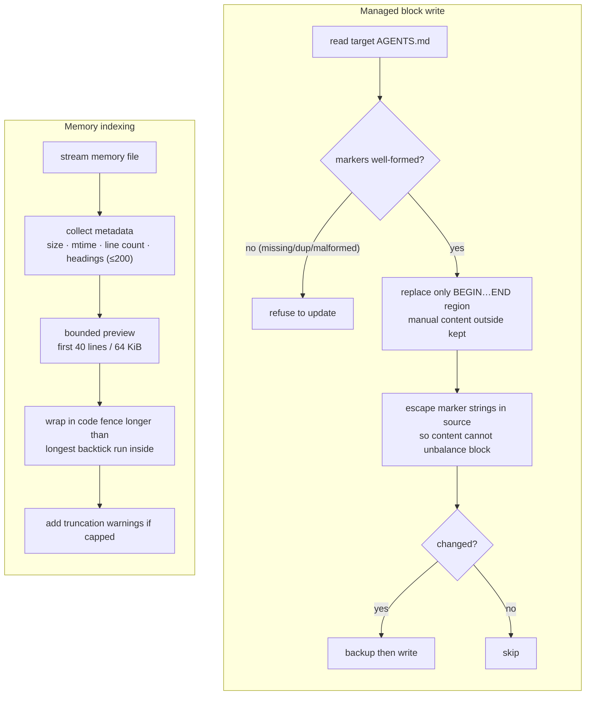
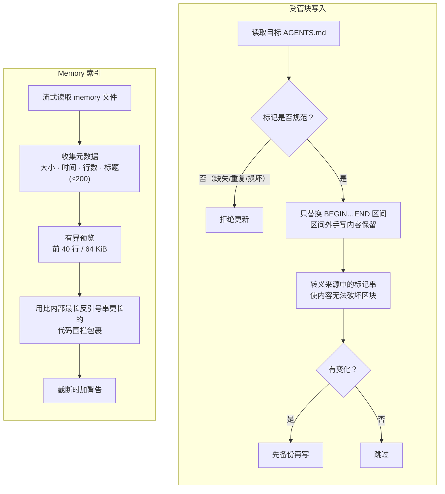

# README Diagrams Implementation Plan

> **For agentic workers:** REQUIRED SUB-SKILL: Use superpowers:subagent-driven-development (recommended) or superpowers:executing-plans to implement this plan task-by-task. Steps use checkbox (`- [ ]`) syntax for tracking.

**Goal:** Add Mermaid diagrams so README readers grasp the tool's purpose, mechanism, and usage flow at a glance.

**Architecture:** Insert 3 core overview diagrams into both READMEs (English + Chinese) under a new `Overview` / `概览` section, and 1 internals diagram into both HOW-IT-WORKS docs. All diagrams are Mermaid (GitHub renders natively). A vitest regression test guards that every diagram block stays present. Diagram syntax was already validated by live Mermaid rendering during the brainstorming/design step; the remaining risk is accidental omission or copy errors, which the test catches, plus a final manual GitHub render check.

**Tech Stack:** Markdown, Mermaid, TypeScript, vitest, Node 20.

**Spec:** `docs/superpowers/specs/2026-07-02-readme-diagrams-design.md`

**Branch:** `docs/readme-diagrams` (already created; spec already committed there).

---

## File Structure

- Modify: `README.md` — add `## Overview` with diagrams 1-3 (English).
- Modify: `README.zh-CN.md` — add `## 概览` with diagrams 1-3 (Chinese).
- Modify: `docs/HOW-IT-WORKS.md` — add `## Internals at a glance` with diagram 4 (English).
- Modify: `docs/HOW-IT-WORKS.zh-CN.md` — add `## 内部机制一览` with diagram 4 (Chinese).
- Create: `tests/docs-diagrams.test.ts` — presence/structure regression guard.

Color legend used in every diagram (keep consistent): purple = Claude sources, blue = tool / write ops, green = Codex outputs / read-only, yellow = undo / safety notes.

---

## Task 1: Regression test for diagram presence

**Files:**
- Test: `tests/docs-diagrams.test.ts`

- [ ] **Step 1: Write the failing test**

Create `tests/docs-diagrams.test.ts`:

```typescript
import fs from "node:fs/promises";
import path from "node:path";
import { describe, expect, it } from "vitest";

const repoRoot = path.resolve(__dirname, "..");

async function read(rel: string): Promise<string> {
  return fs.readFile(path.join(repoRoot, rel), "utf8");
}

function countMermaidBlocks(md: string): number {
  const matches = md.match(/```mermaid/g);
  return matches ? matches.length : 0;
}

describe("README diagrams", () => {
  it("README.md has an Overview section with 3 mermaid diagrams", async () => {
    const md = await read("README.md");
    expect(md).toContain("## Overview");
    expect(countMermaidBlocks(md)).toBe(3);
    // Diagram anchors (unique node ids / labels)
    expect(md).toContain("one-way Markdown bridge");
    expect(md).toContain("bounded preview");
    expect(md).toContain("apply --yes");
  });

  it("README.zh-CN.md has a 概览 section with 3 mermaid diagrams", async () => {
    const md = await read("README.zh-CN.md");
    expect(md).toContain("## 概览");
    expect(countMermaidBlocks(md)).toBe(3);
    expect(md).toContain("单向 Markdown 桥");
    expect(md).toContain("有界预览");
    expect(md).toContain("apply --yes");
  });

  it("HOW-IT-WORKS.md has an internals diagram", async () => {
    const md = await read("docs/HOW-IT-WORKS.md");
    expect(md).toContain("## Internals at a glance");
    expect(countMermaidBlocks(md)).toBe(1);
    expect(md).toContain("markers well-formed?");
  });

  it("HOW-IT-WORKS.zh-CN.md has an internals diagram", async () => {
    const md = await read("docs/HOW-IT-WORKS.zh-CN.md");
    expect(md).toContain("## 内部机制一览");
    expect(countMermaidBlocks(md)).toBe(1);
    expect(md).toContain("标记是否规范");
  });
});
```

- [ ] **Step 2: Run test to verify it fails**

Run: `npx vitest run tests/docs-diagrams.test.ts`
Expected: FAIL — all four assertions fail because the sections/diagrams do not exist yet.

- [ ] **Step 3: Commit the failing test**

```bash
git add tests/docs-diagrams.test.ts
git commit -m "test: guard README/HOW-IT-WORKS diagram presence"
```

---

## Task 2: README.md — English overview diagrams

**Files:**
- Modify: `README.md` (insert between the "New here?" line and `## What it does`)

- [ ] **Step 1: Insert the Overview section**

In `README.md`, find this block:

```markdown
New here? Read [How it works](docs/HOW-IT-WORKS.md) for the design, safety model, and file-by-file behavior.

## What it does
```

Insert the new `## Overview` section between those two lines, so the result reads:

````markdown
New here? Read [How it works](docs/HOW-IT-WORKS.md) for the design, safety model, and file-by-file behavior.

## Overview

**What it does** — one-way bridge from Claude context to Codex-readable files. It never touches Claude, and never writes Codex's native memory database.



**How it works** — each source has its own transform; memory becomes a streamed index with a bounded preview, and settings/skills/plugins are report-only.



**Usage flow** — the main path is look-before-write: `scan` / `plan` write nothing, `apply` writes. `restore` and `clean` are always available.



## What it does
````

- [ ] **Step 2: Run the presence test for README.md**

Run: `npx vitest run tests/docs-diagrams.test.ts -t "README.md"`
Expected: PASS.

- [ ] **Step 3: Commit**

```bash
git add README.md
git commit -m "docs: add overview diagrams to README"
```

---

## Task 3: README.zh-CN.md — Chinese overview diagrams

**Files:**
- Modify: `README.zh-CN.md` (insert between the "第一次使用建议先读" line and `## 能做什么`)

- [ ] **Step 1: Insert the 概览 section**

In `README.zh-CN.md`, find this block:

```markdown
第一次使用建议先读：[工作原理](docs/HOW-IT-WORKS.zh-CN.md)。

## 能做什么
```

Insert the new `## 概览` section between those two lines:

````markdown
第一次使用建议先读：[工作原理](docs/HOW-IT-WORKS.zh-CN.md)。

## 概览

**作用** —— 把 Claude 上下文单向桥接成 Codex 可读的文件。不碰 Claude，也不写 Codex 原生 memory 数据库。



**原理** —— 每种来源各有转换方式；memory 变成流式索引 + 有界预览，而 settings/skills/plugins 只上报不迁移。



**使用流程** —— 主路径先看后写：`scan` / `plan` 不写，`apply` 才落盘。`restore` 与 `clean` 随时可用。



## 能做什么
````

- [ ] **Step 2: Run the presence test for README.zh-CN.md**

Run: `npx vitest run tests/docs-diagrams.test.ts -t "README.zh-CN.md"`
Expected: PASS.

- [ ] **Step 3: Commit**

```bash
git add README.zh-CN.md
git commit -m "docs: add overview diagrams to Chinese README"
```

---

## Task 4: HOW-IT-WORKS.md — English internals diagram

**Files:**
- Modify: `docs/HOW-IT-WORKS.md` (insert after the Pipeline section, before `## Managed blocks`)

- [ ] **Step 1: Insert the internals diagram section**

In `docs/HOW-IT-WORKS.md`, find the line `## Managed blocks` (the first heading after the Pipeline list). Insert this new section immediately **before** it:

````markdown
## Internals at a glance

Two safety mechanisms drive the write path: managed-block replacement and bounded memory indexing.



## Managed blocks
````

(The trailing `## Managed blocks` above is the existing heading — do not duplicate it; it marks where the insertion ends.)

- [ ] **Step 2: Run the presence test for HOW-IT-WORKS.md**

Run: `npx vitest run tests/docs-diagrams.test.ts -t "HOW-IT-WORKS.md has"`
Expected: PASS. (The `-t "HOW-IT-WORKS.md has"` filter matches only the English test name, not the zh-CN one, which still fails until Task 5.)

- [ ] **Step 3: Commit**

```bash
git add docs/HOW-IT-WORKS.md
git commit -m "docs: add internals diagram to HOW-IT-WORKS"
```

---

## Task 5: HOW-IT-WORKS.zh-CN.md — Chinese internals diagram

**Files:**
- Modify: `docs/HOW-IT-WORKS.zh-CN.md` (insert after the 流程 section, before `## 托管区块`)

- [ ] **Step 1: Insert the internals diagram section**

In `docs/HOW-IT-WORKS.zh-CN.md`, find the line `## 托管区块`. Insert this new section immediately **before** it:

````markdown
## 内部机制一览

写入路径由两个安全机制驱动：受管块替换与有界 memory 索引。



## 托管区块
````

(The trailing `## 托管区块` above is the existing heading — do not duplicate it.)

- [ ] **Step 2: Run the full presence test**

Run: `npx vitest run tests/docs-diagrams.test.ts`
Expected: PASS — all four tests green.

- [ ] **Step 3: Commit**

```bash
git add docs/HOW-IT-WORKS.zh-CN.md
git commit -m "docs: add internals diagram to Chinese HOW-IT-WORKS"
```

---

## Task 6: Full verification and manual render check

**Files:** none (verification only)

- [ ] **Step 1: Run the whole test suite**

Run: `npm test`
Expected: PASS — the new `tests/docs-diagrams.test.ts` passes and no existing test regresses.

- [ ] **Step 2: Manually confirm Mermaid renders on GitHub**

The presence test does not validate Mermaid syntax (that needs a browser/DOM). Verify rendering by one of:
- Push the branch and open the PR / branch view on GitHub; confirm all 8 diagram instances (3 in each README + 1 in each HOW-IT-WORKS) render without a red "Syntax error" box.
- Or paste each diagram source into https://mermaid.live and confirm it renders.

Check specifically: `<br/>` line breaks, emoji, `&lt;path&gt;` showing as `<path>`, subgraph colors applied, and no broken edges.

Expected: every diagram renders cleanly in both languages.

- [ ] **Step 3: If a diagram fails to render, fix and re-verify**

Fix the offending Mermaid source in the affected file, re-run `npm test`, and re-check the render. Common culprits: an unescaped `<`/`>` outside a `&lt;`/`&gt;`, or a stray quote inside a `[""]` label.

---

## Self-Review

- **Spec coverage:** Diagrams 1-3 → Tasks 2 & 3 (both READMEs). Diagram 4 → Tasks 4 & 5 (both HOW-IT-WORKS). Placement anchors, bilingual rule, and color legend → carried into each task. Rendering-notes / acceptance criteria → Task 6. All spec sections covered.
- **Placeholder scan:** No TBD/TODO; every insertion shows full literal Markdown; every test shows full code.
- **Consistency:** Node ids (`C1..D3`, `s1..o4`, `scan/plan/apply/report/restore/clean/uninstall/proj`, `m1..n5`) match between English and Chinese versions; the presence test's anchor strings (`one-way Markdown bridge`, `单向 Markdown 桥`, `bounded preview`, `有界预览`, `markers well-formed?`, `标记是否规范`) all appear verbatim in the corresponding insertion.
