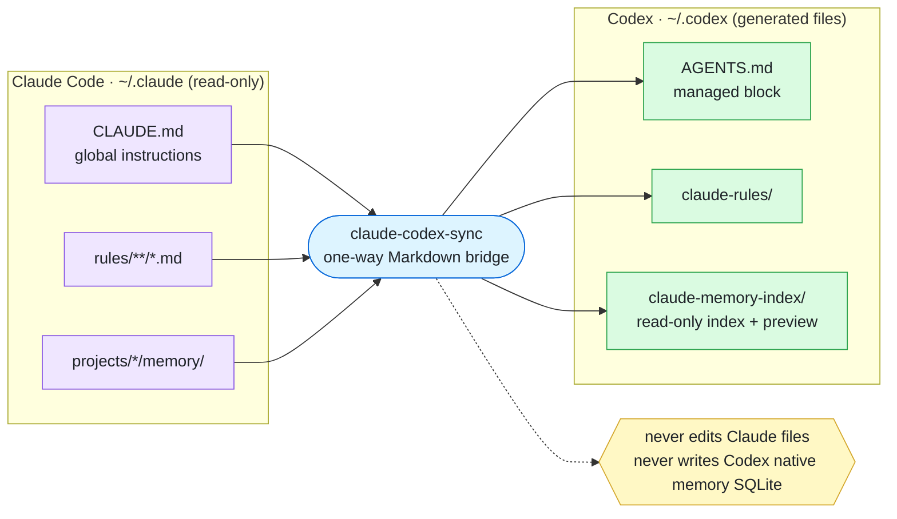
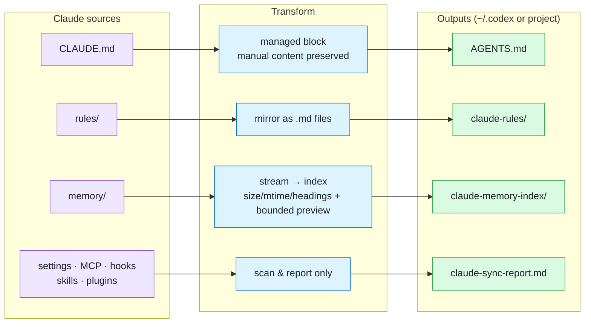
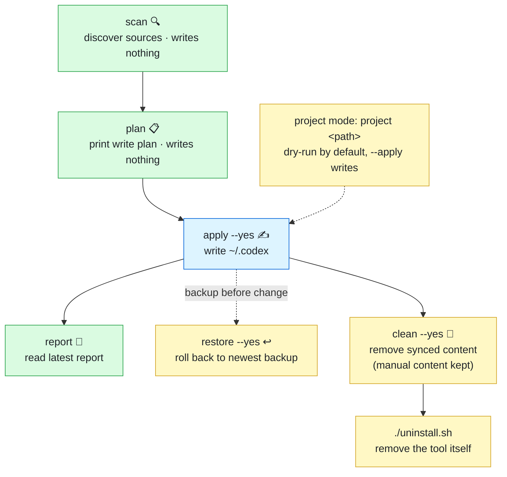
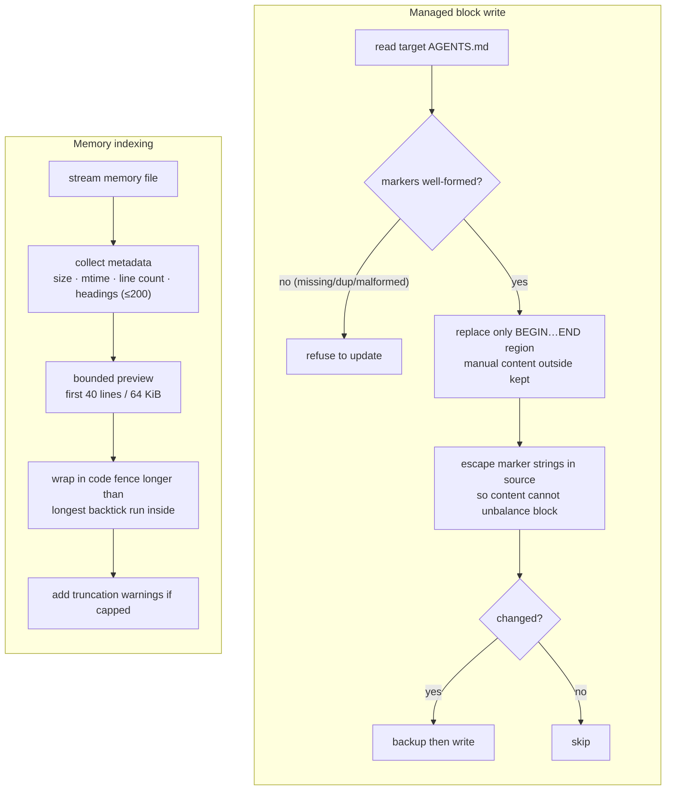

# README 图示设计 — claude-codex-sync

**日期:** 2026-07-02
**目标:** 在 README 用图示让用户一眼看懂本项目的**作用、原理、使用流程**。

## 决策摘要

| 维度 | 决定 |
| --- | --- |
| 图示语言 | Mermaid（GitHub README 原生渲染，随代码版本化、可 diff） |
| 图数量 | 3 张核心概览图 + HOW-IT-WORKS 内 1 张原理细节图 |
| 放置位置 | `README.md` 与 `README.zh-CN.md` 各放 3 张核心图；`docs/HOW-IT-WORKS.md` 与 `docs/HOW-IT-WORKS.zh-CN.md` 各放 1 张细节图 |
| 双语 | 中英文各一套，图内文字按语言用中/英，结构完全相同 |

## 放置锚点

- README：插入到顶部一句话简介之后、`## What it does` 命令表之前，新增 `## Overview` / `## 概览` 小节承载 3 张图。
- HOW-IT-WORKS：细节图放入 `## Managed blocks` 与 `## Memory indexing` 附近，作为这两节的可视化补充。

## 图 1 — 作用图（工具做什么）

一句话表达：把 Claude 上下文单向桥接成 Codex 可读文件；不碰 Claude，不写 Codex 原生记忆库。

## 图 2 — 原理图（每种来源如何变成输出）

四类来源 → 各自转换方式 → 落到哪个文件。突出：memory 是"流式索引 + 有界预览"，settings/MCP/hooks/skills/plugins 只上报不迁移。

## 图 3 — 使用流程图（命令生命周期）

主路径全程"先看后写"：scan / plan 只读，apply 才落盘；右侧是随时可用的撤销与清理。

## 图 4 — HOW-IT-WORKS 原理细节图（受管块 + memory 安全）

放入 HOW-IT-WORKS，展开两个安全机制的内部逻辑。

## 渲染注意事项（实现时验证）

- 全部图在 GitHub 上以 Mermaid 原生渲染，需在真实 GitHub 页面（或 PR preview）确认渲染无误。
- ` ` 换行、emoji、`classDef`/`class` 着色均为 GitHub Mermaid 支持特性；`<`/`>` 在标签内需写作 `&lt;`/`&gt;`。
- 中文版图与英文版结构一致，仅替换图内英文文案为中文（安全红线、命令说明等）。
- 着色语义统一：紫=Claude 来源，蓝=工具/写操作，绿=Codex 输出/只读，黄=撤销/安全提示。

## 验收标准

- [ ] `README.md`、`README.zh-CN.md` 各含图 1/2/3，位于新 `Overview`/`概览` 小节。
- [ ] `docs/HOW-IT-WORKS.md`、`docs/HOW-IT-WORKS.zh-CN.md` 各含图 4。
- [ ] 图内文字与所在文档语言一致。
- [ ] 在 GitHub 上渲染正常（无语法错误、无破版）。
- [ ] 图内容与文字描述的命令/文件/安全模型不矛盾。
